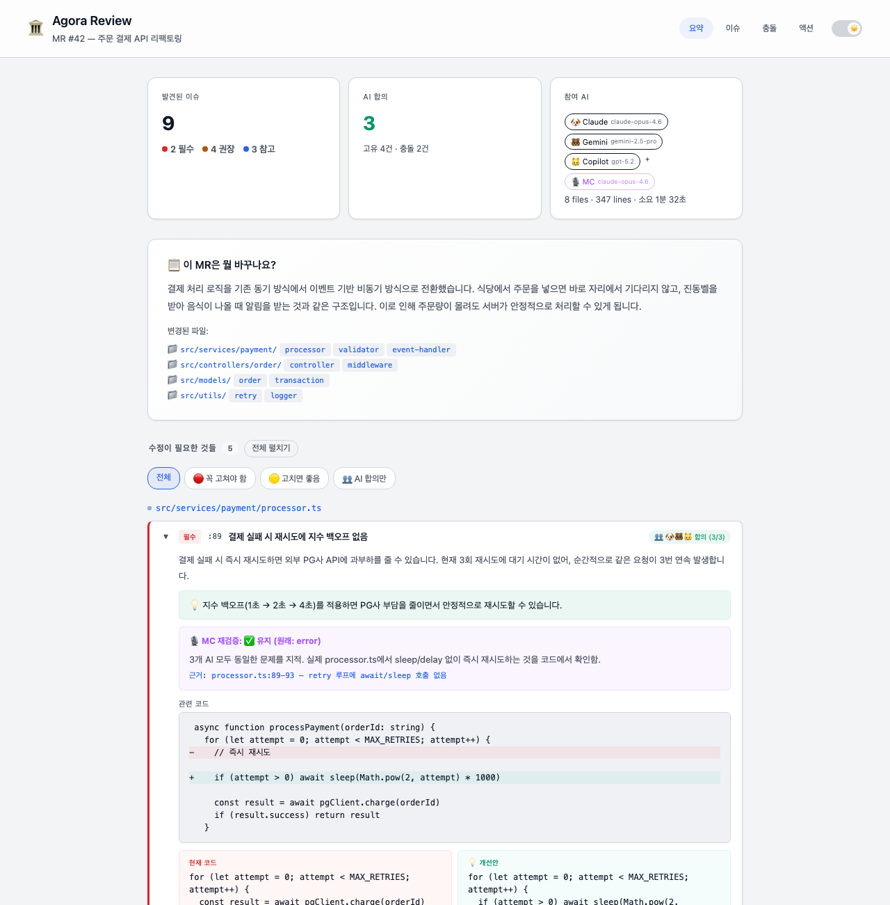
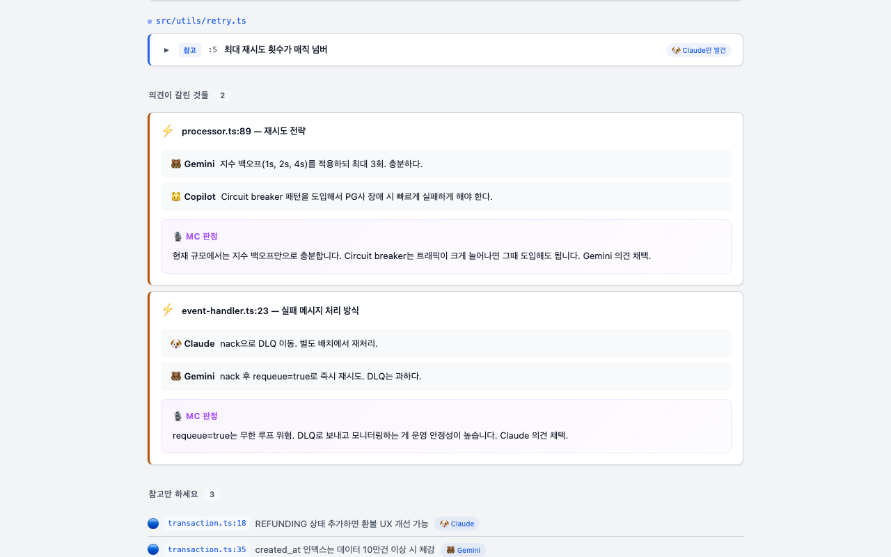
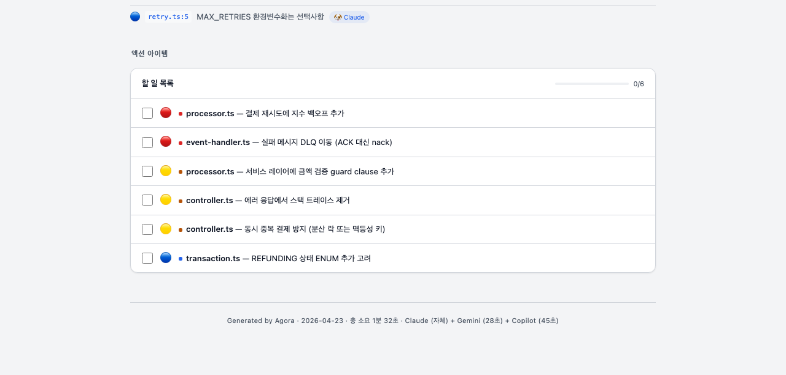

# 🏛️ Agora

[](https://github.com/jeong-jaehyeon/agora/actions/workflows/test.yml)

**3개 AI가 동시에 코드 리뷰. 누가 뭘 발견했는지, 의견이 갈리면 누가 맞는지, 한눈에.**

Claude + Gemini + Copilot에게 같은 diff를 던지고, MC(중재자)가 결과를 비교 분류합니다.
Claude Code에서 `/agora-review` 한 줄이면 끝.



## 왜 만들었나

AI 코드 리뷰를 쓰다 보면 이런 경험이 있습니다:
- Claude는 잡는데 Gemini는 못 잡는 이슈
- Copilot이 error라 했는데 실제로는 의도된 설계
- 3개 AI가 전부 "이거 버그다"라고 했는데 실제로는 아닌 것 (합의 오탐)

**AI 하나만 믿으면 놓치고, 전부 믿으면 시간 낭비.** Agora는 여러 AI의 리뷰를 자동으로 교차 검증합니다.

## 동작 방식

```
           ┌─────────┐
           │ /agora  │
           └────┬────┘
                │
     ┌──────────┼──────────┐
     ▼          ▼          ▼
 🐶 Claude  🐻 Gemini  🐱 Copilot
     │          │          │
     └──────────┼──────────┘
                │
           ┌────▼────┐
           │ 🎙️ MC   │  ← 합의/고유/충돌 분류
           │  재검증   │  ← 합의 오탐 방지
           └────┬────┘
                │
           ┌────▼────┐
           │ 웹 리포트 │  ← 브라우저에서 바로 확인
           └─────────┘
```

**5단계 파이프라인:**
1. diff 가져오기 (GitLab MR URL 또는 로컬 git)
2. 3개 AI에게 병렬로 리뷰 요청 (Gemini + Copilot은 CLI 병렬 실행)
3. MC가 결과를 분류하고, 합의된 필수 이슈는 재검증
4. 웹 리포트 생성 + 브라우저 자동 열기
5. 수정할 항목 선택 → Claude가 자동 수정 + 커밋 *(개발 중)*

## 웹 리포트

### AI 의견 충돌 → MC가 판정

AI끼리 의견이 다르면, MC가 프로젝트 맥락을 보고 판정합니다.



### 액션 아이템 체크리스트

리뷰 결과를 바로 할 일 목록으로. 체크하면 프로그레스 바가 갱신됩니다.



### 주요 기능

- **합의/고유/충돌 분류** — 2개 이상 AI가 같은 이슈를 발견하면 합의, 1개만 발견하면 고유, 의견이 다르면 충돌
- **MC 재검증** — "3개 AI가 전부 버그라 했는데 실제로는 정상"인 합의 오탐을 잡아냄
- **코드 비교** — 현재 코드 vs 개선안을 before/after로 표시
- **다크/라이트 모드** — 오른쪽 상단 토글
- **필터** — 전체 / 꼭 고쳐야 함 / 고치면 좋음 / AI 합의만
- **자동 수정** — 리뷰 후 수정할 항목을 복수 선택하면 Claude가 코드 수정 + 커밋 *(개발 중)*

## 빠른 시작

### 1. 설치

```bash
git clone https://github.com/jeong-jaehyeon/agora.git
cd agora
yarn install
```

### 2. 명령어 등록

```bash
mkdir -p ~/.claude/commands
cp .claude/commands/*.md ~/.claude/commands/
```

이제 **아무 프로젝트에서나** `/agora-review`를 쓸 수 있습니다.

### 3. 실행

```bash
# Claude Code에서
/agora-review
```

처음 실행하면 자동 셋업이 시작됩니다. Gemini CLI, Copilot CLI, GitLab 토큰을 안내에 따라 설정하면 됩니다.

**최소 요구사항:** Gemini 또는 Copilot 중 1개 + Claude Code

## 참여 AI

| AI | 역할 | 호출 방식 |
|----|------|-----------|
| 🐶 Claude | 리뷰어 + MC (중재자) | Claude Code 세션 자체 (외부 호출 없음) |
| 🐻 Gemini | 리뷰어 | `gemini` CLI (Google OAuth) |
| 🐱 Copilot | 리뷰어 | `gh copilot` CLI (GitHub 인증) |

## 프로젝트 구조

```
agora/
├── .github/workflows/
│   └── test.yml            CI: 자동 테스트
├── .claude/commands/
│   ├── agora-review.md              # 메인 커맨드 (5단계 리뷰 플로우)
│   └── agora-setup.md               # 설정 재설정
├── examples/
│   ├── sample-data.json    샘플 리뷰 결과 데이터
│   └── sample-report.html  생성된 HTML 리포트 예시
├── scripts/
│   ├── agora-review.ts              # Gemini/Copilot CLI 오케스트레이터
│   ├── agora-review.test.ts         # 테스트 (16개)
│   ├── env.ts                       # 환경변수 공통 로더
│   ├── env.test.ts                  # env 테스트 (5개)
│   ├── generate-report.test.ts  # 렌더링 헬퍼 단위 테스트 (23개)
│   ├── generate-report.ts           # JSON → HTML 리포트 변환
│   ├── report-template.html         # 웹 리포트 템플릿
│   ├── fetch-sibling-file.ts        # GitLab API: 형제 프로젝트 파일 조회
│   └── find-related-sibling-mrs.ts  # GitLab API: 형제 프로젝트 MR 검색
├── docs/screenshots/                # README용 스크린샷
├── .env.agora.example          환경 변수 템플릿
├── package.json
├── tsconfig.json
└── vitest.config.ts
```

## 테스트

```bash
yarn test        # 44개 테스트 실행
yarn test:watch  # 워치 모드
```

## 설정

`.env.agora` (셋업 시 자동 생성, gitignore 대상):

```
GEMINI_MODEL=gemini-2.0-flash
COPILOT_MODEL=claude-sonnet-4.6
GITLAB_TOKEN=glpat-xxxxx
GITLAB_URL=https://your-gitlab.com   # 선택. 기본값 사용 시 생략 가능
```

## 기술 스택

- **TypeScript** (ESM) + **Vitest** (44개 테스트)
- **Claude Code Custom Commands** (.claude/commands/)
- **CLI 기반 AI 호출** — Gemini CLI + GitHub Copilot CLI (stdin으로 프롬프트 전달, shell injection 방지)
- **HTML 리포트** — 단일 파일, 외부 의존성 없음 (CSS/JS 인라인)

## 왜 "Agora"인가?

아고라(Agora)는 고대 그리스의 광장. 시민들이 모여 토론하고 합의를 이끌어내던 장소.
Agora에서는 AI들이 모여 코드를 토론하고, MC가 합의를 이끌어냅니다.
